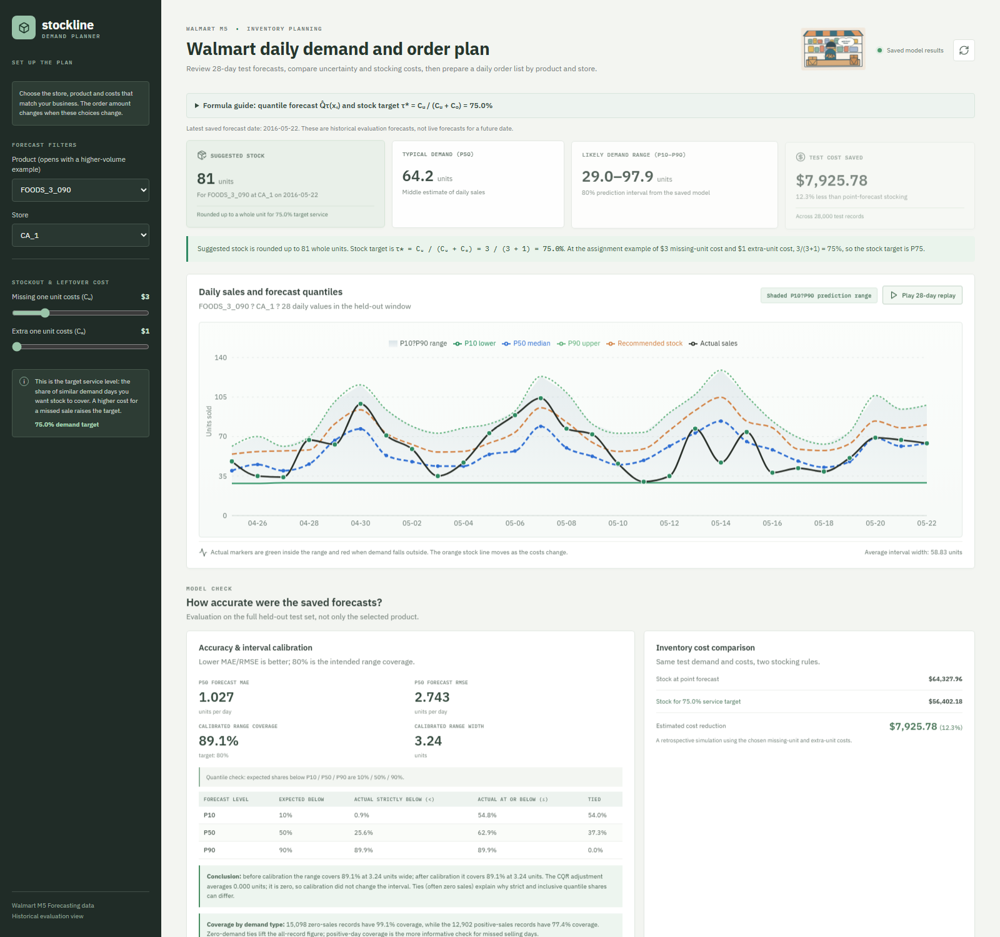
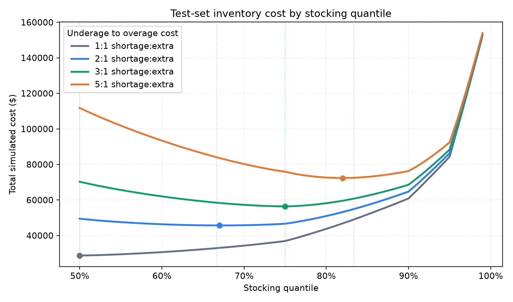

# Demand Forecasting with Uncertainty

An inventory-planning project for daily Walmart item demand. LightGBM forecasts demand percentiles, conformalized quantile regression (CQR) calibrates prediction intervals, and a cost model compares inventory choices when missed sales and leftover stock have different costs.

The dashboard displays saved forecasts for historical M5 test dates. It is an evaluation and planning demonstration, not a live future-forecast service. The M5 source files and generated model/data artifacts are kept out of Git; a clean checkout must download the data and regenerate its outputs before launching the dashboard.

## Project capabilities

- Calendar, event, lagged-sales, rolling-demand, price, and lower-tail history features.
- LightGBM point forecast and quantile forecasts, including P10, P50, P75, P90, P95, and P99.
- Chronological training, validation, and test splits. P10's mix of model output and lagged rolling P10 is selected by validation pinball loss separately for historical-volume tiers.
- Validation-only CQR calibration for an intended 80% P10-P90 interval. Calibration uses volume tiers computed from training-period demand history.
- MAE/RMSE, quantile calibration, interval coverage and width, Winkler score, and conditional failure analysis.
- Inventory cost curves over stocking quantiles and multiple shortage-to-leftover cost ratios.
- FastAPI service and React dashboard with a daily purchase list and optional on-hand/inbound inventory upload.

## Repository structure

```text
backend/                 FastAPI application and dashboard API
frontend/                React + Vite user interface
src/                     Data preparation, features, model, calibration, evaluation
scripts/reproduce.ps1    End-to-end PowerShell reproduction script
data/README.md           Instructions for obtaining the excluded M5 dataset
reports/writeup.md       Experiment approach, results, and limitations
reports/figures/         Generated evaluation charts
tests/                   Feature-leakage and interval-metric checks
requirements.txt         Python dependencies
```

The `backend` and `frontend` names are standard in full-stack projects and match the Python import path and web-app commands used below.

## Dashboard preview



## Requirements and installation

- Python 3.10 or later (examples use Python 3.11)
- Node.js and npm for the dashboard
- M5 Forecasting data from Kaggle

Run these commands from the **repository root** (the folder containing `README.md` and `requirements.txt`). Do not run the Python setup commands from inside `frontend/`.

```powershell
py -3.11 -m venv .venv
.\.venv\Scripts\python.exe -m pip install --upgrade pip
.\.venv\Scripts\python.exe -m pip install -r requirements.txt
```

Download the M5 Forecasting data directly from [Kaggle](https://www.kaggle.com/competitions/m5-forecasting-accuracy/data) and put these required files in `data/raw/`:

```text
sales_train_evaluation.csv
calendar.csv
sell_prices.csv
```

The preparation pipeline reads these three files. Files such as `sales_train_validation.csv` and submission templates may be included in the Kaggle download, but are not needed by this implementation. See [data/README.md](data/README.md) for the data instructions. Raw Kaggle data, processed data, and trained model artifacts are excluded from Git. A clean checkout therefore needs the Kaggle files and a pipeline run before the dashboard can load forecasts.

### What belongs in the GitHub repository

Commit source code, the React/FastAPI application, tests, notebooks, dependency manifests and lockfiles, documentation, and compact aggregate reports or charts. Do not commit original Kaggle files, full-size derived CSV/parquet files, trained model binaries, virtual environments, Python caches, browser profiles, `.env` files, API keys, passwords, cloud credentials, private SSH keys/certificates, or personal information. `.gitignore` excludes these local files; `data/README.md` is the only tracked file intended inside `data/`. Review `git status --short` before committing. If a secret was committed previously, removing it from the latest commit is not enough: revoke/rotate it and remove it from repository history.

## Reproduce the results

With the M5 files in `data/raw/`, run the full pipeline from the repository root. The commands below use the project environment directly, so activation is optional:

```powershell
.\.venv\Scripts\python.exe -m src.prepare_m5
.\.venv\Scripts\python.exe -m src.features
.\.venv\Scripts\python.exe -m src.train
.\.venv\Scripts\python.exe -m src.calibrate
.\.venv\Scripts\python.exe -m src.evaluate
.\.venv\Scripts\python.exe -m src.inventory
.\.venv\Scripts\python.exe -m src.failure_analysis
```

Or run the same sequence as a script. It stops with an explanation if the project environment or a required raw file is missing:

```powershell
powershell -ExecutionPolicy Bypass -File scripts/reproduce.ps1
```

Outputs are written locally to `data/processed/`, `models/`, and `reports/figures/`. Large/local outputs under `data/` and `models/` are ignored by Git. The validation dates calibrate intervals and tune the P10 blend; the separate final 28-day test period is used for reported metrics and inventory simulations. The compact slice-level summary is written to `reports/interval_method_comparison.csv`.

The default preparation samples 100 product IDs spanning the demand range and retains all 10 stores. This yields about 1,000 item/store series and roughly 1.94 million daily records. To choose 250 higher-volume products instead, run:

```powershell
.\.venv\Scripts\python.exe -m src.prepare_m5 --item-count 250 --selection high-volume
```

After changing the sample, rerun every pipeline step. The complete M5 catalog produces roughly 59 million item/store/day records and requires substantially more memory and training time.

### Reproducibility status

The full data-processing, training, calibration, evaluation, inventory, and failure-analysis pipeline was rerun locally against the available M5 data. It regenerated the saved results in this repository. A clean checkout can reproduce them by downloading the specified Kaggle files, installing dependencies, and running the commands above or `scripts/reproduce.ps1`.

## Run the dashboard

First complete the pipeline. Then use two terminals. Run the API command from the repository root and the web-app commands from `frontend/`.

**Terminal 1 - API** (run from the repository root; activation is optional)

```powershell
.\.venv\Scripts\Activate.ps1
\.venv\Scripts\python.exe -m uvicorn backend.main:app --reload --port 8000
```

**Terminal 2 - web app**

```powershell
cd frontend
npm ci
npm run dev
```

Open the Vite URL printed in the terminal (usually `http://localhost:5173`). API documentation is at `http://localhost:8000/docs`.

Choose a product and store, then set the cost of a missed sale and the cost of an extra unit. The dashboard shows the saved demand forecast, prediction range, stocking cost comparison, and daily order list. Download the list as CSV. To subtract stock already on hand or on order, upload a CSV with these columns:

```text
Store,Product,On hand,Already on order
```

The dashboard does not train models or forecast beyond the dates in the M5 evaluation data. Restart the API after regenerating pipeline outputs.

## Method and formulas

### Features and model

Calendar variables include weekday, week, month, weekends, and M5 events. Lag and rolling features are grouped by store and item. They end at `t - 7` for target day `t`, avoiding use of sales from within the seven-day information cutoff. Price drops are used as an imperfect promotion proxy because M5 does not provide complete promotion labels.

LightGBM estimates P10, P50, P75, P90, P95, and P99 demand, in addition to a point forecast. The mixed catalog's raw P10 can collapse near zero for higher-volume products. The pipeline therefore compares the LightGBM P10 with a 56-day lagged empirical P10 on validation, selecting a blend weight from `0, 0.25, 0.50, 0.75, 1.00` by volume tier. This is selected without test data. For the saved run, high-volume series use the rolling P10, while low- and medium-volume series use the model P10.

### Prediction intervals

P10 to P90 is the nominal 80% prediction interval. CQR calculates a correction from validation errors and applies it to test bounds, with corrections estimated by historical-volume tier. The dashboard and scripts report both strict-below (`actual < forecast`) and inclusive (`actual <= forecast`) quantile shares. Many M5 records have zero sales and a zero P10; exact ties inflate the inclusive share. Interval coverage is measured directly by testing whether each actual falls between the lower and upper bounds.

### Inventory decision

The target stock percentile is based on the relative costs of a missed sale and an extra unit:

```text
Target percentile = missed-sale cost / (missed-sale cost + extra-unit cost)
```

For example, costs of $3 for a missed unit and $1 for an extra unit give `3 / (3 + 1) = 75%`, so the policy uses P75. The purchase quantity subtracts on-hand and inbound inventory from the target and is never below zero. The project plots total simulated cost across P50-P99 for several cost ratios. These are retrospective estimates using selected costs, not guaranteed real-world savings.

## Results

The test sample contains 28,000 item/store/day rows across 28 dates, 100 products, and all 10 stores.

| Forecast | MAE (units) | RMSE (units) |
| --- | ---: | ---: |
| Seasonal naive (same weekday last week) | 1.368 | 3.402 |
| 28-day moving average | 1.162 | 2.968 |
| LightGBM point forecast | 1.114 | 2.571 |
| LightGBM median (P50) | 1.027 | 2.743 |

P50 has lower MAE than the point model but higher RMSE. This is expected: the median is suited to absolute error, while the point model is trained for squared-error performance. The project's added value is uncertainty and inventory planning, not a large point-accuracy gain.

The calibrated P10-P90 range covers 89.1% of all test days at a mean width of 3.24 units. This headline is lifted by zero-sales days: 15,098 zero-sales records have 99.1% coverage, while positive-sales coverage is 77.4% across 12,902 records. All three volume-tier CQR adjustments were 0.000 units on this run, so calibration did not change the intervals. The write-up explains the tie behavior and the remaining conditional-coverage weakness.

At a 3:1 missed-sale to extra-unit cost ratio, simulated P75 inventory cost is $56,402, compared with $64,328 for point-forecast stocking, a $7,926 (12.3%) reduction in this test simulation.



The price-drop proxy contains only 51 records and is inconclusive. Holiday/event coverage is 89.6%, close to 89.0% on regular calendar days. Spike coverage is a major weakness at 9.6%; see the [failure analysis](reports/interval_method_comparison.csv) and [project write-up](reports/writeup.md) for method-by-regime and volume-tier comparisons.

## Plain-language glossary

| Term | Meaning |
| --- | --- |
| P10 / P50 / P90 | Lower, middle, and upper demand estimates. |
| Prediction interval | A lower and upper estimate intended to contain a target share of demand outcomes. |
| Coverage | The share of actual test sales that landed inside the predicted range. |
| Calibration | Checking whether forecast shares/ranges match their intended percentages. |
| MAE | Average absolute forecast miss; lower is better. |
| RMSE | Forecast error measure that penalizes larger misses more; lower is better. |
| CQR | A validation-based method that adjusts the width of quantile ranges. |
| Missed-sale cost | Estimated cost when a customer wants an item that is out of stock. |
| Extra-unit cost | Estimated cost of carrying stock that was not sold. |

## Tests and detailed report

Run the leakage and interval-metric checks from the repository root with:

```powershell
.\.venv\Scripts\python.exe -m pytest -q
```

See [reports/writeup.md](reports/writeup.md) for the concise experiment write-up and [reports/project_guide.md](reports/project_guide.md) for a beginner-friendly explanation of the full project, formulas, features, results, strengths, and limitations.
